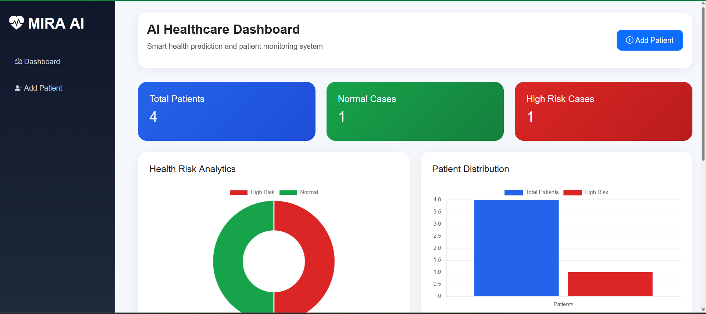
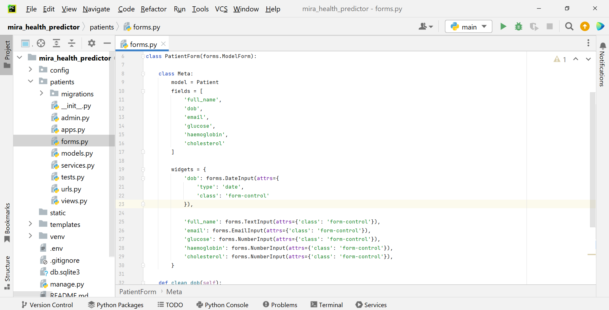
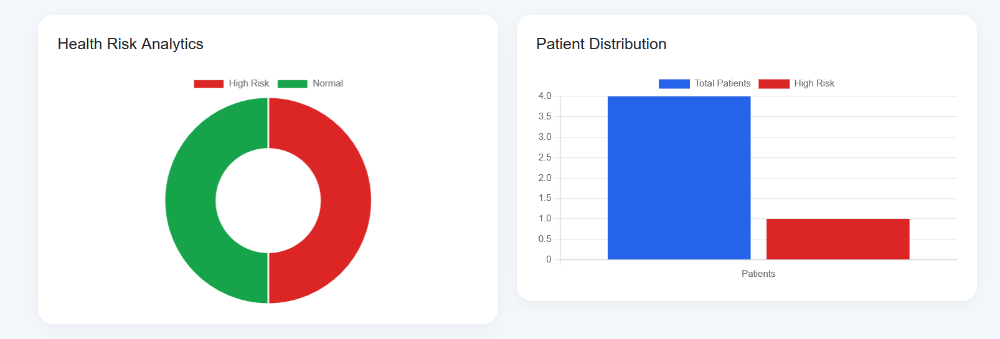
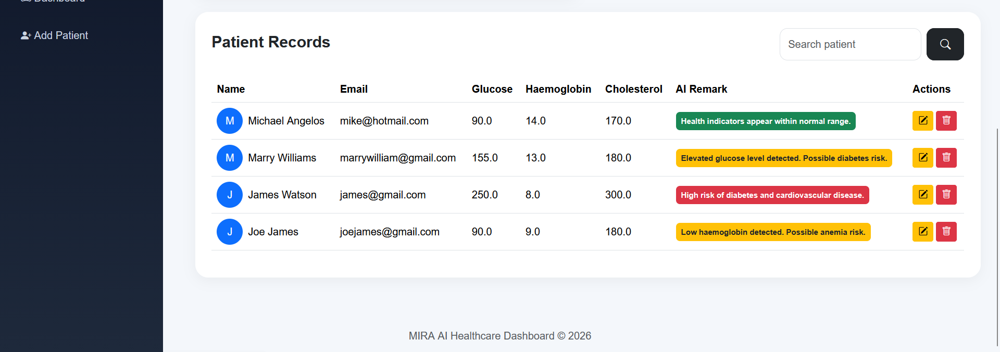

# MIRA Health Predictor

An AI-powered healthcare prediction web application developed using Django, Bootstrap, SQLite, and Google Gemini AI API. The application helps manage patient blood test records and generate intelligent health risk predictions based on blood test values.

---

# Project Overview

MIRA Health Predictor is a healthcare-focused AI web application designed to collect, manage, and analyze patient blood test results. The system performs CRUD operations on patient records and integrates with Google's Gemini AI API to generate AI-based health risk remarks dynamically.

The application provides a clean dashboard interface with patient analytics, AI-generated remarks, search functionality, and responsive UI components.

---

# Features

## Patient Management

* Add new patient records
* View patient records
* Update patient details
* Delete patient records

## AI-Powered Health Prediction

* Integration with Google Gemini AI API
* AI-generated health risk analysis
* Automatic remarks generation based on blood test values

## Data Validation

* Email validation
* Future date prevention for DOB
* Numeric validation for medical values

## Dashboard Features

* Healthcare analytics dashboard
* Search patient functionality
* High-risk indicator badges
* Responsive modern UI
* Interactive dashboard cards

## Persistent Storage

* SQLite database integration using Django ORM

---

# Technologies Used

## Backend

* Python
* Django

## Frontend

* HTML5
* CSS3
* Bootstrap 5
* Bootstrap Icons

## Database

* SQLite

## AI Integration

* Google Gemini API
* google-generativeai library

---

# Patient Data Fields

The application manages the following patient information:

* Full Name
* Date of Birth
* Email Address
* Glucose Level
* Haemoglobin Level
* Cholesterol Level
* AI-Generated Health Remarks

---

# AI Prediction Workflow

1. User enters patient blood test values
2. Django backend validates the input data
3. Application sends medical values to Gemini AI API
4. Gemini AI analyzes health indicators
5. AI-generated prediction is returned
6. Prediction is stored in the Remarks field
7. Results are displayed on the dashboard

---

# Installation Steps

## 1. Clone Repository

```bash
git clone <your-github-repository-link>
```

## 2. Navigate to Project Folder

```bash
cd mira_health_predictor
```

## 3. Create Virtual Environment

```bash
python -m venv venv
```

## 4. Activate Virtual Environment

### Windows

```bash
venv\Scripts\activate
```

### macOS/Linux

```bash
source venv/bin/activate
```

## 5. Install Dependencies

```bash
pip install -r requirements.txt
```

## 6. Create .env File

Create a `.env` file in the root directory and add:

```env
GEMINI_API_KEY=your_api_key_here
```

## 7. Run Migrations

```bash
python manage.py makemigrations
python manage.py migrate
```

## 8. Run Development Server

```bash
python manage.py runserver
```

---

# Application Screens

* AI Healthcare Dashboard
* Add Patient Form
* Patient Records Table
* AI Prediction Remarks System

## Dashboard



## Add Patient Form



## Analytics Charts



## AI Prediction


---

# Challenges Faced

* Integrating external AI API with Django backend
* Designing responsive healthcare dashboard UI
* Handling AI API failures gracefully
* Implementing proper data validation
* Managing dynamic AI-generated predictions

---

# Future Improvements

* PDF report export
* Advanced analytics charts
* User authentication system
* Cloud database deployment
* Advanced ML prediction models
* Medical report upload support

---

# Author

Developed as part of Junior AI/ML Developer Technical Assessment.

---
